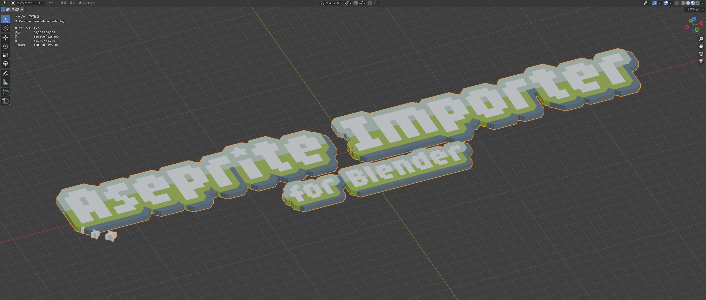

[English](README.md) | [日本語](README.ja.md)

# 🎨 Aseprite Importer for Blender

✨ AsepriteファイルをBlenderにピクセルメッシュとしてインポートし、Solidifyモディファイアを適用します。

📚 **[ドキュメントサイトを見る](https://aseprite-importer.kesera2.dev/ja/)** 詳細なガイドとチュートリアルはこちら。

## ⭐ 機能

- 📥 `.aseprite`ファイルを直接Blenderにインポート
- 🎲 ピクセルアートを自動的に3Dメッシュに変換
- 📦 3Dの厚みを出すためにSolidifyモディファイアを適用
- 🖼️ ピクセルパーフェクトなテクスチャを適切なUVマッピングで保持
- 🪄 透明なピクセルはメッシュ生成から除外

## 💾 インストール

1. 📦 最新リリースをダウンロード
2. 🔧 Blenderで`編集 > プリファレンス > アドオン`を開く
3. ➕ `インストール...`をクリックしてダウンロードしたファイルを選択
4. ✅ "Aseprite Importer"アドオンを有効化

## 📋 必要環境

- 🟦 Blender 2.93以降（Blender 4.2以降でマニフェストサポート）
- 🎨 Asepriteがインストールされていること

::: tip
アドオンは一般的なインストール場所からAsepriteを自動的に検出します。標準的でない場所にインストールされている場合のみ手動設定が必要です。
:::

## 🚀 使い方

1. 📂 `ファイル > インポート > Aseprite (.aseprite)`を選択
2. 🎯 `.aseprite`ファイルを選択
3. ✨ テクスチャとSolidifyモディファイアが適用されたメッシュが作成されます

## ⚙️ 設定

### プリファレンス

`編集 > プリファレンス > アドオン > Aseprite Importer`からアクセス：

- 📁 **Aseprite実行ファイルパス**: Asepriteのインストールパス（デフォルト: `C:\Program Files\Aseprite\Aseprite.exe`）

### インポートオプション

ファイルをインポートする際に設定（`ファイル > インポート > Aseprite (.aseprite)`）：

- 🔢 **フレーム番号**: 複数フレームファイルからインポートするフレーム（デフォルト: 0）
- 📦 **Solidifyモディファイアを追加**: Solidifyモディファイアを自動的に追加（デフォルト: 有効）
- 📏 **Solidifyの幅**: 3Dの厚みをメートル単位で指定（デフォルト: 0.1m）
- 🏷️ **テクスチャプレフィックス**: エクスポートされるテクスチャファイルのプレフィックス（デフォルト: `tex_`）

## 📄 ライセンス

MITライセンス - 詳細は[LICENSE](LICENSE)を参照

## 👤 作者

kesera2
